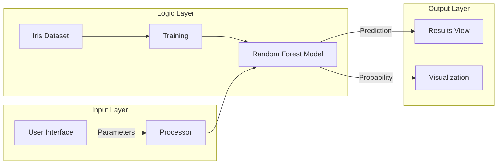

# Iris Intelligence

[](https://elliottfairhall-iris-flower-prediction-main-e0ikd7.streamlit.app/)
[](https://www.python.org/downloads/)
[](https://opensource.org/licenses/MIT)
[](https://github.com/astral-sh/ruff)

A sophisticated machine learning application for botanical classification. This tool leverages the classic Iris dataset
to demonstrate the practical application of predictive modeling in biological research.


*(Iris Versicolor - One of the target species)*

## Features

- **Real-time Inference**: Instant classification based on user-input biological parameters
- **Probability Analysis**: Detailed breakdown of prediction confidence across all classes
- **Interactive Workspace**: Intuitive sidebar controls for adjusting sepal and petal dimensions
- **Responsive Design**: Clean, modern interface built with Streamlit

## Architecture



## Project Structure

```
Iris-Flower-Prediction/
├── app.py                  # Application entry point
├── src/
│   ├── __init__.py
│   ├── model.py            # ML model definition and training
│   ├── ui.py               # Interface components
│   └── utils.py            # Helper functions
├── assets/                 # Static assets
├── pyproject.toml          # Project configuration
├── requirements.txt        # Dependencies
└── README.md
```

## Requirements

- Python 3.10 or higher
- Streamlit >= 1.32.0
- scikit-learn >= 1.3.0
- Pandas >= 2.0.0

## Installation

1. Clone the repository:

   ```bash
   git clone https://github.com/elliottfairhall/Iris-Flower-Prediction.git
   cd Iris-Flower-Prediction
   ```

2. Create a virtual environment:

   ```bash
   python -m venv venv
   source venv/bin/activate  # On Windows: venv\Scripts\activate
   ```

3. Install dependencies:

   ```bash
   pip install -r requirements.txt
   ```

## Usage

1. Start the application:

   ```bash
   streamlit run app.py
   ```

2. Open your browser at `http://localhost:8501`.

3. Explore the **Project Overview** tab to understand the methodology, then switch to the **Analysis Workspace**.

4. Use the sidebar to adjust the following parameters:

   - Sepal Length
   - Sepal Width
   - Petal Length
   - Petal Width

5. Click **Process Intelligence** to see the classification results.

## Business Use Case

While based on a classic dataset, this project demonstrates core capabilities relevant to enterprise AI:

- **Classification Systems**: Building engines to categorize data points based on feature vectors (e.g., customer
  segmentation, risk assessment).
- **Model Deployment**: Wrapping ML models in user-friendly interfaces for non-technical stakeholders.
- **Real-time Analytics**: Providing instant feedback systems for decision support.

## License

This project is licensed under the MIT License - see the [LICENSE](LICENSE) file for details.

## Author

**Elliott Fairhall**

- Website: [data-flakes.dev](https://data-flakes.dev)
- GitHub: [@elliottfairhall](https://github.com/elliottfairhall)
- LinkedIn: [Elliott Fairhall](https://uk.linkedin.com/in/elliott-fairhall-666945105)
